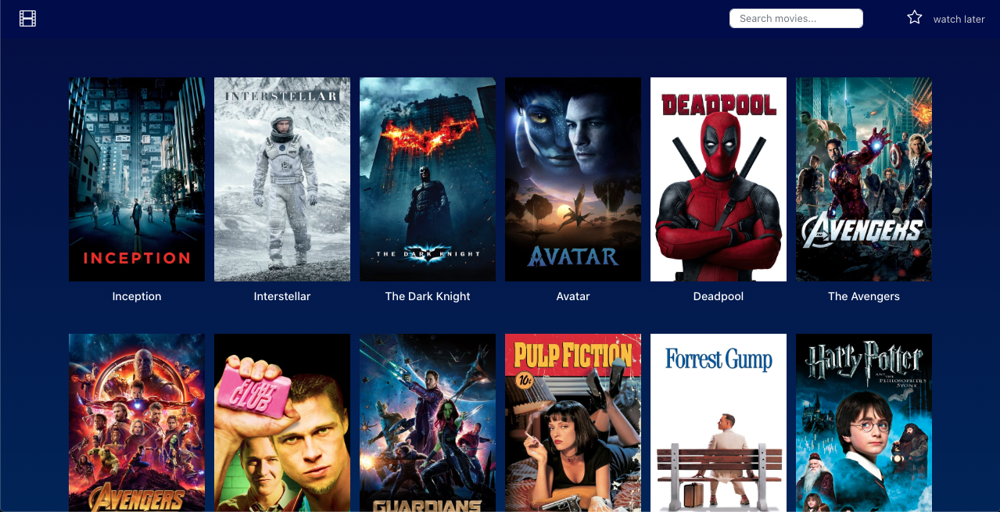
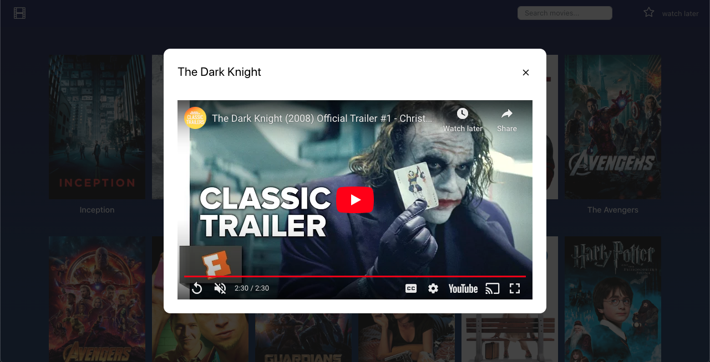
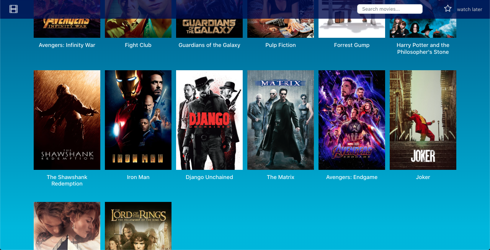
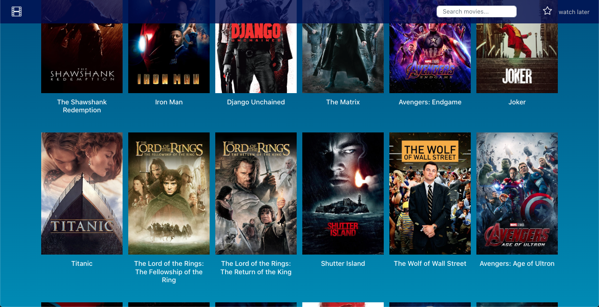
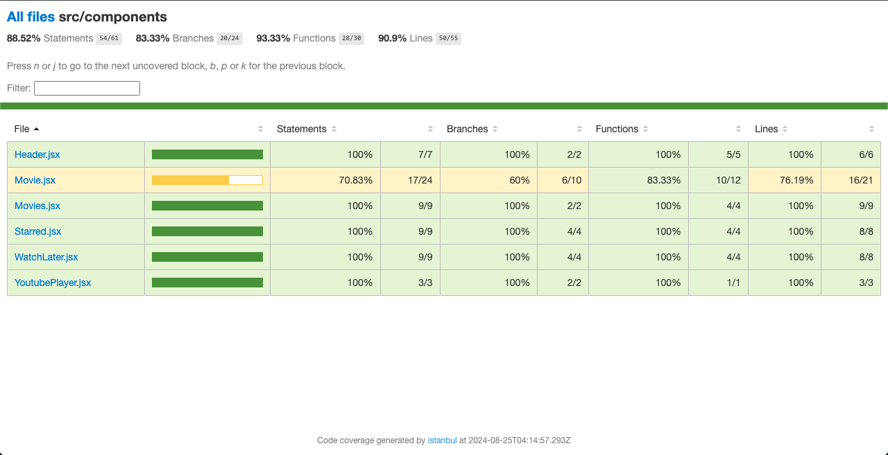

# Movieland 

This is the submission of the assignment for the position of Frontend Developer at Leovegas. Here is a description of the tasks that were : 

## Task 1

I have performed a basic code review of the application, and the points have been noted in the [CODE_REVIEW.md](./CODE_REVIEW.md) file

I have also modified the code at a few places.

## Task 2

### Implement a Grid Layout using css and preprocessors

### Implement a modal for viewing trailers

### Adding Infinite Scrolling 

## Unit Testing

There were a few existing tests, but some of them were failing for me. I edited the same and added more test cases to test all the functionalities. 

Here is the screenshot of the coverage report:

### Some Clarifications

- I have disabled the StrictMode because it renders the app component twice, inturn leading to fetching the initial data 2 times. If we enable it, we will see that the same data is loaded twice, but then the app works as expected. 
This is because Strictmode renders the component twice to be extra sure of not doing errors. However this action is not there on production.

- I have created a hook for checking if the user as scrolled to the bottom of the screen. If yes, I fetch the data again. I could have used 3rd party libraries as well for implementing Infinite scroll, but wanted to create a basic working version myself to demonstrate my knowledge

- I have tested most of the application, leaving out some part which I felt was not worth the effort involved in writing the test cases

- I have kept the UI same as it was earlier (unless where explicitly asked to change it, like modal for trailer). However, there can be a few changes in the UI which would make the application more user friendly